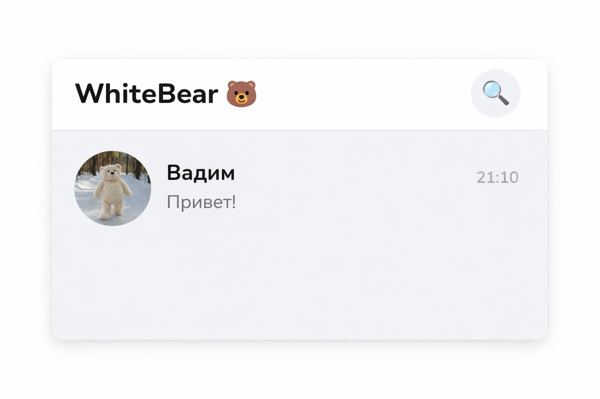

# 🐻 WhiteBear — мессенджер для своих

> Быстрый, удобный и безопасный мессенджер. Без рекламы, без лишнего — только общение.



## ✨ Возможности

- 💬 **Личные чаты** в реальном времени (Supabase Realtime)
- 📷 **Фото** — просмотр на весь экран, скачивание
- 🎥 **Видео** — воспроизведение прямо в чате + полноэкранный просмотр
- 📎 **Файлы** — любые форматы (PDF, DOC, ZIP и др.) с кнопкой скачать
- ❤️ **Реакции** на сообщения — появляются в реальном времени
- ↩️ **Ответ на сообщение**
- 🗑️ **Удаление сообщений** — мгновенно исчезает у обоих
- 🌙 / ☀️ **Тёмная и светлая тема**
- 📳 **Звук и вибрация** при новых сообщениях
- 🔤 **Размер шрифта** — маленький / средний / большой
- 🔐 **Смена пароля**
- 📤 **Экспорт данных** (JSON)
- 🟢 **Статус онлайн** — в сети / был(а) X минут назад
- 📩 **Баннер новых сообщений** при скролле вверх
- 👤 **Профиль** — аватар, имя, О себе

## 🚀 Быстрый старт

1. Скачай файл `WB_ME.html`
2. Открой в браузере — готово!

Или опубликуй на GitHub Pages / Vercel / Netlify одним файлом.

## 🛠 Настройка Supabase

### 1. Создай проект на [supabase.com](https://supabase.com)

### 2. Вставь свои ключи в `WB_ME.html`

```js
const SUPABASE_URL = 'https://ВАШ-ПРОЕКТ.supabase.co';
const SUPABASE_KEY = 'ВАШ_ANON_KEY';
```

### 3. Создай таблицы в Supabase SQL Editor

```sql
-- Профили пользователей
create table profiles (
  id uuid references auth.users on delete cascade primary key,
  name text,
  phone text unique,
  bio text default '',
  avatar_url text,
  is_online boolean default false,
  last_seen timestamptz default now()
);

-- Разрешить всем читать профили (нужно для контактов)
alter table profiles enable row level security;
create policy "profiles readable by all" on profiles for select using (true);
create policy "users update own profile" on profiles for update using (auth.uid() = id);
create policy "users insert own profile" on profiles for insert with check (auth.uid() = id);

-- Сообщения
create table messages (
  id uuid default gen_random_uuid() primary key,
  sender_id uuid references profiles(id) on delete cascade,
  receiver_id uuid references profiles(id) on delete cascade,
  content text,
  image_url text,
  file_url text,
  file_name text,
  file_size bigint,
  is_read boolean default false,
  reply_to_id uuid,
  reply_content text,
  reply_author text,
  created_at timestamptz default now()
);

alter table messages enable row level security;
create policy "users see own messages" on messages for select
  using (auth.uid() = sender_id or auth.uid() = receiver_id);
create policy "users send messages" on messages for insert
  with check (auth.uid() = sender_id);
create policy "users delete own messages" on messages for delete
  using (auth.uid() = sender_id);
create policy "users update own messages" on messages for update
  using (auth.uid() = sender_id or auth.uid() = receiver_id);

-- Реакции
create table reactions (
  id uuid default gen_random_uuid() primary key,
  message_id uuid references messages(id) on delete cascade,
  user_id uuid references profiles(id) on delete cascade,
  reaction text not null,
  created_at timestamptz default now(),
  unique(message_id, user_id)
);

alter table reactions enable row level security;
create policy "reactions readable by all" on reactions for select using (true);
create policy "users manage own reactions" on reactions for all using (auth.uid() = user_id);
```

### 4. Включи Realtime для таблиц

В Supabase → **Database → Replication** → включи для таблиц:
- `messages`
- `reactions`

### 5. Создай Storage buckets

В Supabase → **Storage** → создай два bucket:

| Bucket | Публичный |
|--------|-----------|
| `avatars` | ✅ Public |
| `chat-files` | ✅ Public |

Для каждого добавь политику (Policies → New policy):
```sql
-- Для avatars: разрешить загрузку авторизованным
create policy "auth users upload avatars" on storage.objects
  for insert with check (bucket_id = 'avatars' and auth.role() = 'authenticated');

create policy "public read avatars" on storage.objects
  for select using (bucket_id = 'avatars');

-- Для chat-files: аналогично
create policy "auth users upload files" on storage.objects
  for insert with check (bucket_id = 'chat-files' and auth.role() = 'authenticated');

create policy "public read files" on storage.objects
  for select using (bucket_id = 'chat-files');
```

## 📁 Структура проекта

```
whitebear/
├── WB_ME.html      # Весь проект в одном файле
├── README.md       # Документация
├── preview.png     # Скриншот для Open Graph (добавь сам)
└── .gitignore
```

## 🌐 Деплой на GitHub Pages

1. Создай репозиторий на GitHub
2. Загрузи файлы
3. Settings → Pages → Source: `main` branch, `/root`
4. Твой мессенджер доступен по адресу `https://ИМЯ.github.io/whitebear/WB_ME.html`

## 🔑 Технологии

- **Supabase** — БД, аутентификация, realtime, хранилище
- **Vanilla JS** — без фреймворков
- **CSS Variables** — тёмная/светлая тема
- **Nunito Font** — Google Fonts

## 📜 Лицензия

MIT — используй как хочешь 🐻
